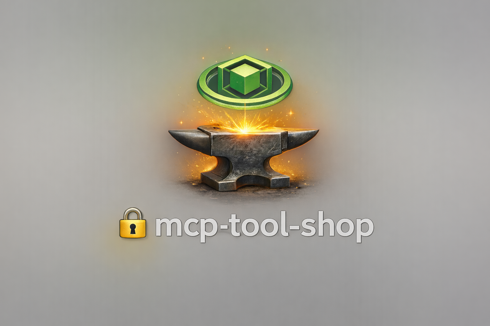

<div align="center">



# mcp-tool-shop

**The catalog and promotion engine for tools that AI agents use to get real work done.**

[Live Site](https://mcp-tool-shop.github.io/) · [Trust Center](https://mcp-tool-shop.github.io/trust/) · [Browse Tools](https://mcp-tool-shop.github.io/tools/)

</div>

---

## Who this is for

- **Tool authors** in [mcp-tool-shop-org](https://github.com/mcp-tool-shop-org) who want their project listed, promoted, and verified.
- **Journalists and reviewers** looking for press kits with receipt-backed claims. See the [Presskit Handbook](docs/presskit-handbook.md).
- **Other orgs** who want to fork the promotion engine for their own catalog. See [Portable Core](docs/portable-core.md).

**Not for**: End users of individual tools -- go to the [tool pages](https://mcp-tool-shop.github.io/tools/) instead.

## 60-Second Quickstart

```bash
git clone https://github.com/mcp-tool-shop/mcp-tool-shop.git
cd mcp-tool-shop/site
npm install
npm run dev          # localhost:4321
```

To add a tool: push a repo to [mcp-tool-shop-org](https://github.com/mcp-tool-shop-org), then run Actions > "Sync org metadata". The tool appears on the next deploy.

## Featured Tools

- **[File Compass](https://github.com/mcp-tool-shop-org/file-compass)** -- Semantic file search with HNSW indexing and local Ollama embeddings. Multi-language AST chunking, <100ms queries over 10K+ files.
- **[Tool Compass](https://github.com/mcp-tool-shop-org/tool-compass)** -- Find MCP tools by describing what you need. 115+ indexed tools, progressive disclosure pattern.
- **[Soundboard Plugin](https://github.com/mcp-tool-shop-org/soundboard-plugin)** -- Give Claude Code a voice. 12 voices, emotion-aware speech, multi-speaker dialogue.
- **[Brain-Dev](https://github.com/mcp-tool-shop-org/brain-dev)** -- MCP server for code analysis: test generation, security audits, health scoring.
- **[Comfy-Headless](https://github.com/mcp-tool-shop-org/comfy-headless)** -- Headless ComfyUI with prompt intelligence and video generation.

## Proof

Every promotion is backed by receipts, not promises.

- **548 tests** (442 unit + 106 invariant), all passing
- **Receipt-verified promotions** -- every promo week has hashed inputs and a commit SHA ([browse receipts](https://mcp-tool-shop.github.io/receipts/))
- **Freeze modes** -- automation pauses when frozen; humans must intervene ([Trust Center](https://mcp-tool-shop.github.io/trust/))
- **Decision drift detection** -- week-over-week changes are flagged automatically
- **Proven claims** -- MarketIR claims are evidence-backed and independently verifiable ([view proofs](https://mcp-tool-shop.github.io/proof/))

Verify any week yourself: visit a [promo page](https://mcp-tool-shop.github.io/receipts/), copy the commit SHA, checkout that commit, and compare `sha256sum` on each input file.

## Stack

```
Python · TypeScript · C# · .NET MAUI · WinUI 3
MCP · FastMCP · Ollama · HNSW · CUDA
Windows-first · RTX 5080 · Local-only
```

## Philosophy

Everything runs locally. No cloud dependencies for core functionality. Tools compose through the Model Context Protocol. Append-only where it matters. Accessibility baked in, not bolted on.

*Syntropy above all else.*

---

## Documentation

| Doc | Purpose |
|-----|---------|
| [Quickstart](docs/quickstart.md) | Zero to trust receipt in 5 minutes (npm package) |
| [Handbook](docs/HANDBOOK.md) | How the site works, common tasks, glossary |
| [Presskit Handbook](docs/presskit-handbook.md) | Brand assets, blurbs, verification examples for press |
| [Automation contract](docs/automation.md) | Data ownership, override schema, merge rules |
| [Portable Core](docs/portable-core.md) | Fork the engine for your own org |
| [Security model](docs/SECURITY-MODEL.md) | Threat model, sanitization, CI controls |
| [Ops Runbook](docs/OPS-RUNBOOK.md) | Weekly operations, promotion pipeline, error codes |
| [Contributing](CONTRIBUTING.md) | Local dev setup, testing |

## Support

- **Issues**: [github.com/mcp-tool-shop/mcp-tool-shop/issues](https://github.com/mcp-tool-shop/mcp-tool-shop/issues)
- **Trust verification**: [Trust Center](https://mcp-tool-shop.github.io/trust/)
- **Press inquiries**: [Presskit Handbook](docs/presskit-handbook.md)

<div align="center">

**[mcp-tool-shop-org](https://github.com/mcp-tool-shop-org)** · **[mcp-tool-shop.github.io](https://mcp-tool-shop.github.io/)**

</div>
